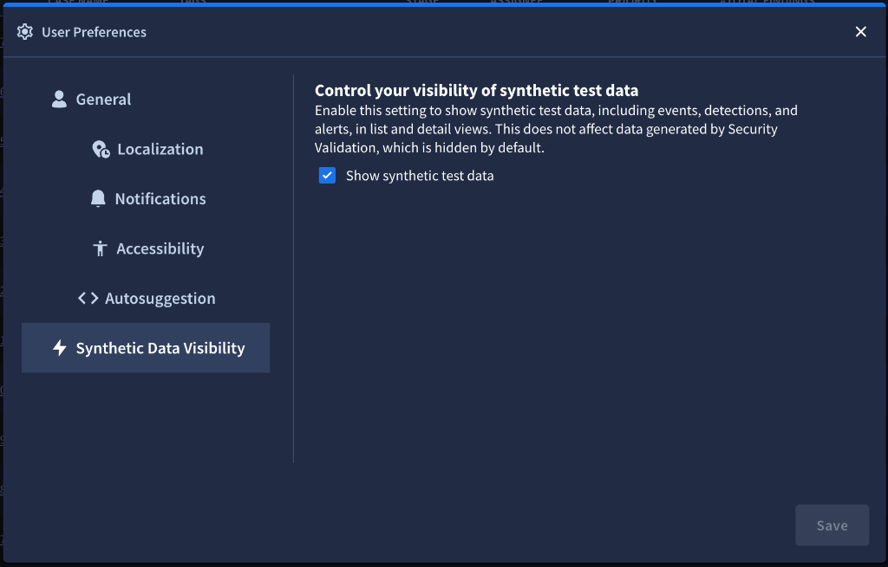

# Agentic Detection Engineering in Google SecOps

Agentic Detection Engineering (ADE) enables security teams to automate and accelerate the end-to-end detection engineering lifecycle using Google Security Operations (SecOps) APIs and AI assistants. 

By integrating threat intelligence, automated Threat Detection Opportunity (TDO) extraction, synthetic telemetry simulation, and sandbox rule coverage evaluations, ADE transforms unstructured threat descriptions into tested, production-ready YARA-L 2.0 detection rules.

---

## Overview

Traditional detection engineering requires manual parsing of threat intelligence reports, manual drafting of adversary simulation commands or test logs, tedious cross-referencing against existing rule corpora, and extensive manual tuning to write YARA-L 2.0 detection rules.

Agentic Detection Engineering in Google SecOps streamlines this into a continuous, automated lifecycle:

```
+-----------------------------+
| Threat Intelligence Ingest  | (Blogs, Reports, CVEs, TTPs)
+--------------+--------------+
               |
               v
+-----------------------------+
| TDO Generation              | (generate_threat_detection_opportunity)
+--------------+--------------+
               |
               v
+-----------------------------+
| Synthetic Simulation        | (generate_synthetic_events)
+--------------+--------------+
               |
               v
+-----------------------------+
| Rule Coverage Evaluation    | (evaluate_rule_coverage_long_running)
+--------------+--------------+
               |
               v
+-----------------------------+
| Operation Polling & Results | (get_operation)
+--------------+--------------+
               |
               +-----------------------+
               |                       |
       [Coverage Confirmed]      [Coverage Gap]
               |                       |
               v                       v
      (No action needed)       +-----------------------------+
                               | Candidate Rule Generation   | (generate_rules)
                               +--------------+--------------+
                                              |
                                              v
                               +-----------------------------+
                               | Human Review & Deployment   | (test_rule, create_rule)
                               +-----------------------------+
```

---

## The Detection Engineering Lifecycle

### 1. Threat Detection Opportunity (TDO) Extraction
Detection engineers or autonomous agents analyze threat reports, advisories, or post-incident reviews to identify observable adversary behaviors. Using `generate_threat_detection_opportunity`, the input text is transformed into structured TDO objects containing:
- **TDO ID**: Unique identifier (e.g., `t01`, `t02`).
- **Summary**: Concise description of the attacker tactic or procedure.
- **MITRE ATT&CK Mapping**: Specific tactics and techniques (e.g., `T1059.001` PowerShell, `T1071.001` Web Protocols).
- **Log Types**: Relevant Chronicle log ingestion types (e.g., `WINEVTLOG`, `PROCESS_EXECUTION`, `GCP_CLOUDAUDIT`).

### 2. Synthetic Event Simulation
To evaluate whether existing detection rules would catch the activity, `generate_synthetic_events` generates high-fidelity synthetic telemetry. This produces:
- Raw mock log lines matching the targeted log type formats.
- Structured Unified Data Model (UDM) events with appropriate entity metadata (`principal`, `target`, `network`, `about`).
- JSON-encoded UDM event strings (`udmJson`) formatted for direct consumption by Chronicle evaluation engines.

### 3. SecOps UI: Synthetic Data Visibility
Synthetic events and the resulting detections can be displayed directly in the Google SecOps Web UI for interactive inspection and validation.

To view synthetic telemetry in list and detail views:
1. Navigate to **Google SecOps**.
2. Click **Settings** (gear icon) in the navigation bar.
3. Select **User Preferences** > **Synthetic Data Visibility**.
4. Check **Show synthetic test data**.
5. Click **Save**.



> **Note:** Enabling this setting displays synthetic test data (including events, detections, and alerts) in list and detail views across Chronicle. This does not affect data generated by Security Validation, which remains hidden by default.

### 4. Rule Coverage Evaluation via Long-Running Operations (LRO)
Evaluating synthetic events against an organization's active ruleset is computationally intensive. The tool `evaluate_rule_coverage_long_running` initiates an asynchronous evaluation job via Chronicle's `:evaluateRuleCoverageLongRunning` API endpoint:
- **Sandboxed Execution:** Synthetic events are evaluated in an ephemeral sandbox without committing test records to permanent customer log storage.
- **Composite Coverage Control:** The `exclude_composite_coverage` parameter allows filtering out multi-event composite rules when testing single atomic behaviors.
- **Asynchronous Operation:** Returns a standard Google Long-Running Operation resource (e.g., `operations/dea-bkFXS0...`).

### 5. Polling Operation Status
The `get_operation` tool polls the returned operation name until completion:
- **In-Progress:** Returns operation metadata including progress status and percentages.
- **Completed:** Returns the final evaluation result containing covered TDO IDs, uncovered TDO IDs, matching rule identifiers, and matched event counts.

### 6. Candidate Rule Synthesis
For any TDO identified as having a coverage gap, `generate_rules` synthesizes candidate YARA-L 2.0 detection rules. The generated rules include:
- Informative `meta` section with author, description, severity, and MITRE ATT&CK tags.
- Precise `events` logic referencing UDM fields.
- Deduplication and aggregation logic in `match` and `condition` sections.

### 7. Human-in-the-Loop Review and Deployment
Generated rules must never be automatically activated in production without human validation. Detection engineers follow these verification steps:
1. **Rule Logic Inspection:** Verify UDM field references and thresholds.
2. **Backtesting (`test_rule`):** Execute historical test queries over real tenant data to assess alert volume and detect potential false positives.
3. **Draft Rule Creation (`create_rule`):** Deploy rule in a disabled (`enabled=False`) or alerting-only state for staging observation.
4. **Activation:** Enable live evaluation once verified (via the SecOps console or rule management tools).

---

## Available MCP Tools

The `secops-mcp` server provides 5 purpose-built tools for Agentic Detection Engineering:

| Tool | Purpose | Key Parameters |
|------|---------|----------------|
| `generate_threat_detection_opportunity` | Extracts structured TDOs from threat descriptions | `threat_description`, `log_types` |
| `generate_synthetic_events` | Synthesizes realistic raw logs and UDM test events | `threat_detection_opportunities` |
| `evaluate_rule_coverage_long_running` | Starts asynchronous rule coverage evaluation LRO | `threat_detection_opportunity_events`, `exclude_composite_coverage` |
| `get_operation` | Polls status and retrieves LRO evaluation results | `name` |
| `generate_rules` | Generates candidate YARA-L 2.0 rules for coverage gaps | `threat_detection_opportunities`, `background_context` |

For detailed parameter schemas and API reference, see [SecOps MCP Tools](servers/secops_mcp.md).

---

## Agent Skill: `detection-engineering-coverage-evaluation`

The **Google SecOps Extension** packages this entire workflow into a turnkey agent skill:

- **Trigger:** `/security:detect`, `"Evaluate coverage for [URL/Text]"`, `"Develop detections for [Threat]"`.
- **Location:** `extensions/google-secops/skills/detection-coverage/SKILL.md` (exposed via `.agent/skills/detection-coverage/`).
- **Prompt Injection Safeguards:** Threat intelligence articles and external blog URLs are treated as untrusted data. The skill enforces clear demarcation between ingested threat content and agent execution instructions.
- **Human Authorization Gate:** Explicit user confirmation is strictly required prior to saving or enabling any detection rules in production.

---

## Example Workflow

### Step 1: Ingest Threat Description
```python
tdo_response = generate_threat_detection_opportunity(
    threat_description="""
    Adversaries execute encoded PowerShell commands to download secondary stage payloads
    from external C2 servers and establish persistent scheduled tasks.
    """,
    log_types=["WINEVTLOG", "PROCESS_EXECUTION"]
)
```

### Step 2: Generate Synthetic UDM Events
```python
events_response = generate_synthetic_events(
    threat_detection_opportunities=tdo_response["threat_detection_opportunities"]
)
```

### Step 3: Evaluate Coverage Sandbox
```python
lro_response = evaluate_rule_coverage_long_running(
    threat_detection_opportunity_events=events_response["threat_detection_opportunity_events"],
    exclude_composite_coverage=True
)
operation_name = lro_response["name"]
```

### Step 4: Poll LRO Until Done
```python
status = get_operation(name=operation_name)
# Poll until status["done"] is True
# Coverage results indicate uncovered TDOs
```

### Step 5: Generate YARA-L 2.0 Rule for Gaps
```python
rules_response = generate_rules(
    threat_detection_opportunities=uncovered_tdos,
    background_context="Enterprise Windows workstations with Defender and Sysmon telemetry."
)
```

---

## Related Documentation

- [SecOps MCP Server Reference](servers/secops_mcp.md)
- [Detection Engineer Persona](personas/detection_engineer.md)
- [Google SecOps Extension Skills](google_secops_extension.md)
- [Official Google SecOps ADE Guide](https://docs.cloud.google.com/chronicle/docs/secops/agentic-detection-engineering)
