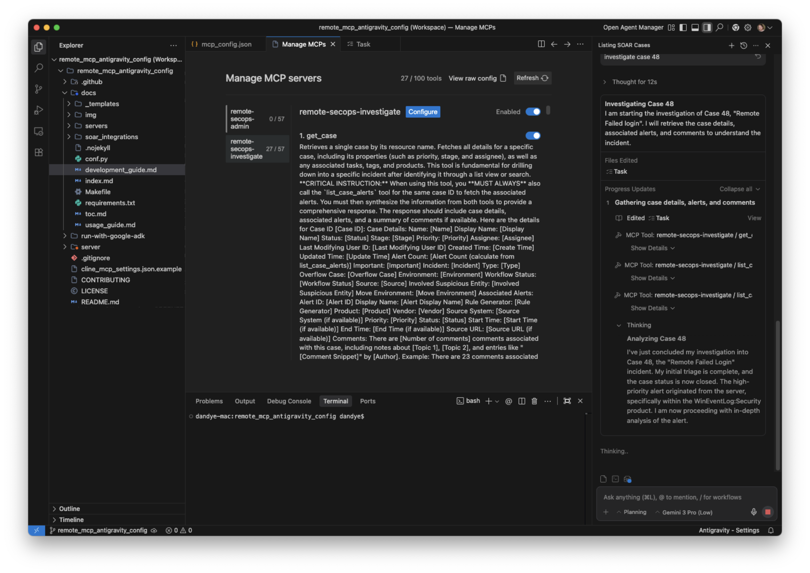

# Antigravity MCP Configuration Guide

This guide describes how to configure "Antigravity" (the Agentic IDE) to connect to the Remote SecOps MCP server.

## Overview

Antigravity has a limit of **50 tools per MCP server**. The remote SecOps MCP server currently provides **57 tools**. To expose all tools, we configure the same remote server twice in `$HOME/.gemini/antigravity/mcp_config.json`, but we use the `disabledTools` configuration to split the tools into two logical groups:

1.  **Investigation & Response**: Tools for cases, alerts, entities, rules, and search.
2.  **Administration & Configuration**: Tools for feeds, parsers, data tables, reference lists, and playbooks.

You then need to toggle on only one MCP server at a time in Antigravity.

## Configuration

Add the following configuration to your `$HOME/.gemini/antigravity/mcp_config.json`.

> [!NOTE]
> Replace `YOUR_ACCESS_TOKEN` with a valid Google Cloud OAuth access token.
> You will unfortunately need to refresh this token periodically or use a script to generate it.

### Getting YOUR_ACCESS_TOKEN

After running `gcloud auth application-default login`, you have set up your Application Default Credentials (ADC). To retrieve the actual token string generated by that specific login for use in an HTTP header, run the following command in your terminal:

```bash
gcloud auth application-default print-access-token
```

**Common Usage Patterns**

1.  **Copy directly to clipboard (Mac/Linux)**
    This is useful if you are pasting the token into the JSON config file below.

    *   **Mac**: `gcloud auth application-default print-access-token | pbcopy`
    *   **Linux**: `gcloud auth application-default print-access-token | xclip -selection clipboard`


```json
{
  "mcpServers": {
    "remote-secops-investigate": {
      "serverUrl": "https://chronicle.googleapis.com/mcp",
      "headers": {
        "Content-Type": "application/json",
        "x-goog-user-project": "secops-ai-staging",
        "Authorization": "Bearer YOUR_ACCESS_TOKEN"
      },
      "disabled": false,
      "disabledTools": [
         "list_feeds",
         "get_feed",
         "create_feed",
         "update_feed",
         "enable_feed",
         "disable_feed",
         "delete_feed",
         "generate_feed_secret",
         "list_parsers",
         "get_parser",
         "run_parser",
         "create_parser",
         "activate_parser",
         "deactivate_parser",
         "import_logs",
         "list_log_types",
         "list_data_tables",
         "create_data_table",
         "list_data_table_rows",
         "add_rows_to_data_table",
         "delete_data_table_row",
         "create_reference_list",
         "get_reference_list",
         "update_reference_list",
         "list_integrations",
         "list_integration_instances",
         "list_integration_actions",
         "list_playbooks",
         "list_playbook_instances",
         "translate_udm_query"
      ]
    },
    "remote-secops-admin": {
      "serverUrl": "https://chronicle.googleapis.com/mcp",
      "headers": {
        "Content-Type": "application/json",
        "x-goog-user-project": "secops-ai-staging",
        "Authorization": "Bearer YOUR_ACCESS_TOKEN"
      },
      "disabled": false,
      "disabledTools": [
        "list_cases",
        "get_case",
        "update_case",
        "create_case_comment",
        "list_case_comments",
        "execute_bulk_close_case",
        "execute_manual_action",
        "list_security_alerts",
        "get_security_alert",
        "update_security_alert",
        "list_case_alerts",
        "get_case_alert",
        "update_case_alert",
        "search_entity",
        "summarize_entity",
        "get_involved_entity",
        "list_involved_entities",
        "list_rules",
        "get_rule",
        "validate_rule",
        "create_rule",
        "list_rule_detections",
        "list_rule_errors",
        "list_connector_events",
        "get_connector_event",
        "udm_search",
        "get_ioc_match"
      ]
    }
  }
}
```

## Tool Groups

### remote-secops-investigate (Investigation & Response)
Contains ~27 tools for daily SOC operations:
- **Cases**: `list_cases`, `get_case`...
- **Alerts**: `list_security_alerts`, `get_security_alert`...
- **Entities**: `search_entity`, `summarize_entity`...
- **Rules**: `list_rules`, `get_rule`...
- **Search**: `udm_search`, `get_ioc_match`

### remote-secops-admin (Administration & Configuration)
Contains ~30 tools for engineering and configuration:
- **Feeds**: `list_feeds`, `create_feed`...
- **Parsers**: `list_parsers`, `run_parser`...
- **Data Tables**: `list_data_tables`, `add_rows_to_data_table`...
- **Reference Lists**: `create_reference_list`...
- **Integrations/Playbooks**: `list_integrations`, `list_playbooks`...

### Antigravity Example

The following image shows the *Investigation & Response* toolset enabled in Antigravity. Note how the configuration splits the tools to stay within the 50-tool limit.


