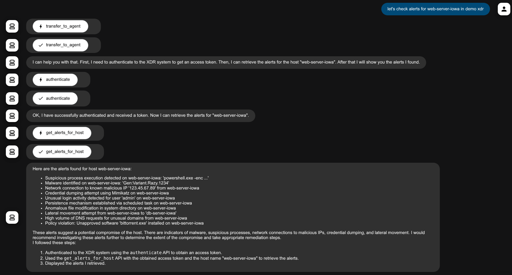
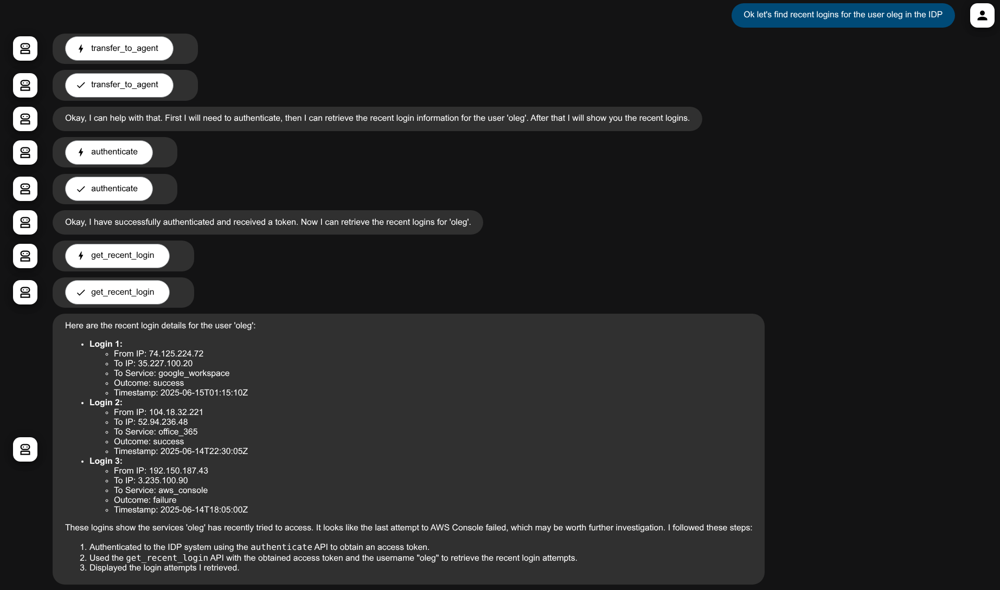

# Google ADK Security Agent Guide

This guide provides instructions on how to run the Autonomous Security Operations Center (SOC) Agent powered by Google ADK v2 and the Model Context Protocol (MCP), both locally via an interactive CLI and deployed to Google Cloud Run.

## Table of Contents

1. [Quickstart: Running Agent Locally](#1-quickstart-running-agent-locally)
2. [CLI Commands & Subcommands](#2-cli-commands--subcommands)
3. [Running Agent as a Cloud Run Service](#3-running-agent-as-a-cloud-run-service)
4. [Deploying on Vertex AI Agent Engine](#4-deploying-on-vertex-ai-agent-engine)
5. [Configuration & Environment Variables](#5-configuration--environment-variables)

---

## 1. Quickstart: Running Agent Locally

### Prerequisites
1. Python 3.11+
2. [uv](https://docs.astral.sh/uv/) (recommended) or `pip`
3. Google Cloud Project with Chronicle SIEM, SCC, GTI, or SOAR access

### Installation & Execution

```bash
# Clone the repository
git clone https://github.com/google/mcp-security.git
cd mcp-security/run-with-google-adk

# Copy the sample environment file and configure your API keys / project IDs
cp sample.env .env

# Start interactive chat session
uv run mcp-security-agent chat
```

Alternatively, install in editable mode:
```bash
python3 -m venv .venv
source .venv/bin/activate
pip install -e .

mcp-security-agent info
mcp-security-agent chat
```

## 2. CLI Commands & Subcommands

The package exposes the `mcp-security-agent` CLI with the following commands:

* `mcp-security-agent info`: Displays current package version, active model, and MCP server status.
* `mcp-security-agent chat`: Launches an interactive terminal REPL for threat investigation.
* `mcp-security-agent serve --host 0.0.0.0 --port 8080`: Launches the FastAPI server with `/healthz`, `/info`, and `/chat` endpoints for Cloud Run.

Use your favorite editor and update `./google-mcp-security-agent/.env`. 

The default `.env` file is shown below. 

1. Update the variables as needed in your favorite editor. You can choose to load some or all of the MCP servers available using the load environment variable at the start of each section.
2. Make sure that variables in the `MANDATORY` section have proper values (make sure you get and update the `GOOGLE_API_KEY` using these [instructions](https://ai.google.dev/gemini-api/docs/api-key)).
3. You can experiment with the prompt `DEFAULT_PROMPT`.
4. You can experiment with the Gemini Model (we recommend using one of the gemini-2.5 models). Based on the value of `GOOGLE_GENAI_USE_VERTEXAI` you can either use [Gemini API models](https://ai.google.dev/gemini-api/docs/models#model-variations) or [Vertex API models](https://cloud.google.com/vertex-ai/generative-ai/docs/models).

```bash
APP_NAME=google_mcp_security_agent
# SESSION_SERVICE - in_memory/db. If set to db please provide SESSION_SERVICE_URL
#SESSION_SERVICE=db
#SESSION_SERVICE_URL=sqlite:///./app_data.db 

# ARTIFACT_SERVICE - in_memory/gcs. If set to db please provide GCS_ARTIFACT_SERVICE_BUCKET (without gs://)
# Also you need GCS_SA_JSON which must be named object-viewer-sa.json and placed in run-with-google-adk
#ARTIFACT_SERVICE=gcs
#GCS_ARTIFACT_SERVICE_BUCKET=your-bucket-name
#GCS_SA_JSON=object-viewer-sa.json

# Total interactions sent to LLM = MAX_PREV_USER_INTERACTIONS + 1
MAX_PREV_USER_INTERACTIONS=3

# SecOps MCP
LOAD_SECOPS_MCP=Y
CHRONICLE_PROJECT_ID=NOT_SET
CHRONICLE_CUSTOMER_ID=NOT_SET
CHRONICLE_REGION=NOT_SET

# GTI MCP
LOAD_GTI_MCP=Y
VT_APIKEY=NOT_SET

# SECOPS_SOAR MCP
LOAD_SECOPS_SOAR_MCP=Y
SOAR_URL=NOT_SET
SOAR_APP_KEY=NOT_SET

# SCC MCP
LOAD_SCC_MCP=Y

# MANDATORY
GOOGLE_GENAI_USE_VERTEXAI=False
GOOGLE_API_KEY=NOT_SET
# If you plan to use Gemini API - Models list - https://ai.google.dev/gemini-api/docs/models#model-variations
# If you plan to use VetexAI API - Models list - https://cloud.google.com/vertex-ai/generative-ai/docs/models
GOOGLE_MODEL=gemini-2.5-flash
# Should be single quote, avoid commas if possible but if you use them they are replaced with semicommas on the cloud run deployment
# you can change them there.
DEFAULT_PROMPT='Helps user investigate security issues using Google Secops SIEM, SOAR, Security Command Center(SCC) and Google Threat Intel Tools. All authentication actions are automatically approved. If the query is about a SOAR case try to provide a backlink to the user. A backlink is formed by adding /cases/<case id> to this URL when present in field ui_base_link of your input. If the user asks with only ? or are you there? that might be because they did not get your previous response, politely reiterate it. Try to respond in markdown whenever possible.'

# Initially a long timeout is needed
# to load the tools and install dependencies
STDIO_PARAM_TIMEOUT=60.0


# Following properties must be set when 
# 1. GOOGLE_GENAI_USE_VERTEXAI=True or 
# 2. When deploying to Cloud Run
# 3. When deploying to Agent Engine
GOOGLE_CLOUD_PROJECT=YOUR-CLOUD-RUN-PROJECT-ID
GOOGLE_CLOUD_LOCATION=us-central1

# HIGHLY RECOMMENDED TO SET Y AFTER INITIAL TESTING ON CLOUD RUN
MINIMAL_LOGGING=N

# Agent Engine Deployment (without gs://)
#AE_STAGING_BUCKET=your-bucket-name
# If using custom ui, resource name from AE (projects/<project_num>/locations/<region>/reasoningEngines/<reasoning_engine_id>) is needed
#AGENT_ENGINE_RESOURCE_NAME=YOUR_AE_RESOURCE_NAME


# Add Your MCP server variables here, sample provided
# MCP-1
#LOAD_XDR_MCP=Y
#XDR_CLIENT_ID=abc123
#XDR_CLIENT_SECRET=xyz456
# MCP-2
#LOAD_IDP_MCP=Y
#IDP_CLIENT_ID=abc123
#IDP_CLIENT_SECRET=xyz456


```

Once the variables are updated in `.env`, run the agent (make sure you are in the `mcp-security/run-with-google-adk` directory).

```bash
# Authenticate to use Google Cloud / SecOps APIs
# Skip if running in Google Cloud Shell
gcloud auth application-default login

# Start interactive terminal chat
uv run mcp-security-agent chat

# Or start the ADK Web interface
adk web src/mcp_security_agent
```

Access the agent interface by navigating to `http://localhost:8000`.

> **NOTE:**  
> First response usually takes a moment as the agent connects to the configured MCP server(s) and initializes tool schemas.

> **CAUTION:**  
> In case an investigation seems stuck or an error occurs on the console, you can ask a follow-up question like `Are you still there?` or `Can you retry that?`. You can also enable token streaming in the ADK UI.

#### Running Agent with Custom Session and Artifact Services

Google ADK provides persistent [sessions](https://google.github.io/adk-docs/sessions/) and [artifacts](https://google.github.io/adk-docs/artifacts/).

You can run the agent with the session and artifact service of your choice:

```bash
# Run with SQLite session storage and GCS artifact bucket
adk web src/mcp_security_agent --session_service_uri sqlite:///./app_data.db --artifact_service_uri gs://<your_bucket_name>

# Run with SQLite session storage only
adk web src/mcp_security_agent --session_service_uri sqlite:///./app_data.db
```

When the artifact service is backed by GCS, signed URLs allow easy file sharing. Grant the runtime service account the `roles/storage.objectViewer` role.


## 2. Running Agent as a Cloud Run Service

The agent with MCP servers can be deployed as a Cloud Run Service, right from within the source code directory.

Before you do this, please consider following

1. Do you really need it? Deployment is recommended in scenarios where you need to share agent with your team members who may not have access to all of the backend services (SCC, SecOps - SIEM, SecOps - SOAR, Google Threat Intelligence)
2. Make sure that after initial testing  
    1. Require authentication for your agent (steps provided [below](#restrict-service-to-known-developers--testers))
    2. Implement restrictive logging (steps provided [below](#adjust-logging-verbosity))

### Prerequisites

1. Must have locally run the ADK based agent successfully at least once. Environment variables `GOOGLE_CLOUD_PROJECT` and `GOOGLE_CLOUD_LOCATION` should have valid values.
2. Must have required APIs enabled and proper IAM access ([details](https://cloud.google.com/run/docs/deploying-source-code#before_you_begin))

### Costs
In addition to Gemini/ Vertex API costs, running agent will incur cloud costs. Please check [Cloud Run Pricing](https://cloud.google.com/run/pricing).

> ⚠️ **WARNING:**  
> It is not recommended to run the a Cloud Run service with unauthenticated invocations enabled (we do that initially for verification). Please follow steps to enable [IAM authentication](https://cloud.google.com/run/docs/authenticating/developers) on your service. You could also deploy it behind the [Identity Aware Proxy (IAP)](https://cloud.google.com/iap/docs/enabling-cloud-run) - but that is out of scope for this documentation.

### Deployment Steps

> **NOTE:**  
> It is recommended to switch to Vertex AI (with `GOOGLE_GENAI_USE_VERTEXAI=True`) when deploying to Cloud Run.

```bash
# Build and deploy the container directly to Cloud Run
gcloud run deploy mcp-security-agent-service \
  --source . \
  --region us-central1 \
  --allow-unauthenticated \
  --set-env-vars="LOAD_SECOPS_MCP=Y,LOAD_SCC_MCP=Y,LOAD_GTI_MCP=Y,GOOGLE_GENAI_USE_VERTEXAI=True"
```

Now, you can verify the service by browsing to the service endpoint URL.

### IAM access to use Chronicle and SCC

Please remember that Cloud Run uses default service account of compute engine service. Go to IAM and provide the service account access to "Chronicle API Viewer" (in the project associated with your SecOps instance) and appropriate role for SCC (roles starting with Security Center in IAM)


### Restrict Service To Known Developers / Testers

Summarizing the steps from [IAM authentication](https://cloud.google.com/run/docs/authenticating/developers)

1. Goto Cloud Run - Services - click `mcp-security-agent-service`
2. Click `Security`
3. In `Authentication`, `Use Cloud IAM to authenticate incoming requests` should be already selected.
4. Select the radio button `Require authentication`
5. Click `Save`
6. Cloud Run - Services - select `mcp-security-agent-service`
7. At the top click `permissions`, a pane `Permissions for mcp-security-agent-service` should open on the right hand side.
8. Click `Add principal`
9. Add the users you want to provide access to and provide them `Cloud Run Invoker` role.
10. Wait for some time.

### Accessing the restricted service

1. Ask your users to run the following command (replace project id and region with the project id & region in which you have deployed the service)

```bash
gcloud run services proxy mcp-security-agent-service --project PROJECT-ID --region YOUR-REGION

```
2. Now they can access the Cloud Run Service locally on `http://localhost:8080`


### Vertically scaling your container(s)
In case the Cloud Run logs show errors like below, you can consider increasing the resources for the individual containers

`Memory limit of 512 MiB exceeded with 543 MiB used. Consider increasing the memory limit, see https://cloud.google.com/run/docs/configuring/memory-limits`

##### Steps

1. Goto Cloud Run - Services - click `mcp-security-agent-service`
2. Click `Edit & deploy new revision`
3. In `Container(s)` - `Edit Container(s)` - `Settings`
4. Add resources by updating either Memory/ CPU or both.

### Adjust Logging Verbosity
Since the entire context and response from the LLM is printed as logs. You might end up logging some sensitive information. Setting the environment variable `MINIMAL_LOGGING` to `Y` should fix this issue. This should also reduce cloud logging costs. Please do this once you have verified the service initially. Changes to be made directly on Cloud Run service and it will result in restarting the service. Verify service logs after the change is made.

## 3. Deploying and Running Agent on Agent Engine

The agent can also be deployed on [Vertex AI Agent Engine](https://cloud.google.com/vertex-ai/generative-ai/docs/agent-engine/overview> **NOTE:**  
> Currently the GCS backed artifact service is not available on Agent Engine.

Here are the deployment steps:

1. Test locally at least once using `mcp-security-agent chat` or `mcp-security-agent serve`.
2. Ensure environment variables `GOOGLE_CLOUD_PROJECT` and `GOOGLE_CLOUD_LOCATION` are configured.
3. Deploy the agent to Vertex AI Agent Engine using the Google Cloud SDK or ADK CLI.
4. Verify the agent on the [Vertex AI Agent Engine Console](https://console.cloud.google.com/vertex-ai/agents/agent-engines).

### How to Test

You can interact with the deployed backend via the bundled web interface:

1. Update the environment variable `AGENT_ENGINE_RESOURCE_NAME` with your reasoning engine resource path.
2. Start the local server: `uv run mcp-security-agent serve`
3. Access the UI locally at `http://localhost:8080` (or configured port).

---

## 4. Improving Performance and Optimizing Costs

By default, the agent sends the active conversation context to the LLM.

A user interaction involves:
1. User query (e.g., `Let's investigate case 146`)
2. Initial LLM call with System Prompt, User Query, and Tool definitions resulting in function call requests (e.g., `get_case_details`)
3. Agent executing MCP tool requests
4. LLM processing tool outputs and generating the final response

By tweaking the environment variable `MAX_PREV_USER_INTERACTIONS` (default: 3), you can control the conversation history sent to the LLM to optimize latency and token costs.

---

## 5. Integrating Custom MCP Servers

If your organization uses additional security products (such as identity providers or third-party EDRs), integrating them with Google Security MCP servers provides:

1. A unified investigation interface breaking down organizational silos.
2. Automated cross-tool correlation between SIEM alerts, SCC findings, GTI threat intelligence, and IDP accounts.

### Reference Integration Templates

Reference templates are provided in `run-with-google-adk/sample_servers_to_integrate/`:

1. Inspect sample MCP servers in `run-with-google-adk/sample_servers_to_integrate/mcp_servers/` (`demo_idp` and `demo_xdr`).
2. Inspect sample sub-agents in `run-with-google-adk/sample_servers_to_integrate/agents/` (`demo_idp_agent.py` and `demo_xdr_agent.py`).
3. Connect sub-agents into `src/mcp_security_agent/agent.py` using native ADK `sub_agents`:

```python
# src/mcp_security_agent/agent.py
from sample_servers_to_integrate.agents.demo_idp_agent import create_demo_idp_agent
from sample_servers_to_integrate.agents.demo_xdr_agent import create_demo_xdr_agent

idp_agent = create_demo_idp_agent()
xdr_agent = create_demo_xdr_agent()

# Add to sub_agents list when instantiating LlmAgent
agent = LlmAgent(
    name="SecurityOperationsAgent",
    model=settings.google_model,
    instruction=settings.default_prompt or SOC_AGENT_SYSTEM_PROMPT,
    tools=toolsets,
    sub_agents=[sub for sub in [idp_agent, xdr_agent] if sub is not None],
    before_model_callback=bmc_trim_llm_request,
)
```

Configure corresponding environment variables in `.env`:

```properties
LOAD_XDR_MCP=Y
XDR_CLIENT_ID=demo_client_id
XDR_CLIENT_SECRET=demo_client_secret

LOAD_IDP_MCP=Y
IDP_CLIENT_ID=demo_client_id
IDP_CLIENT_SECRET=demo_client_secret
```

You can now query the agent locally:
* `Check alerts for web-server-iowa in demo xdr`
* `Find recent logins for user oleg in IDP`

> **NOTE:**  
> Once tested, you can attach production MCP servers following this modular pattern.

Reference architecture screenshots:

Sample XDR:


Sample IDP:



## 6. Additional Features

The prebuilt agent also allows creating files and signed URLs to these files. A possible scenario is when you want to create a report. You can say "add the summary as markdown to summary_146.md". This creates a file and saves it using the artifact service. You can later ask for a shareable link to this file - "create a link to file summary_146.md"

## 7. Registering Agent Engine Agent to AgentSpace

1. When an agent is deployed on Agent Engine ([guide](#3-deploying-and-running-agent-on-agent-engine)) you get a resource name. Make sure you have it to carry out next steps
2. Go to the Agentspace [page](https://console.cloud.google.com/gen-app-builder/engines) in Google Cloud Console.
3. Create an App (Type - AgentSpace)
4. Note down the app details including the app name (e.g. google-security-agent-app_1750057151234)
5. Make sure that you have the Agent Space Admin role while performing the following actions
6. Enable Discovery Engine API for your project
7. Provide the following roles to the Discovery Engine Service Account  
   Vertex AI viewer  
   Vertex AI user  
8. Please note that these roles need to be provided into the project housing your Agent Engine Agent. Also you need to enable the show Google provided role grants to access the Discovery Engine Service Account.
9. Now to register the agent and make it available to your application use the following shell script. Please replace the variables `AGENT_SPACE_PROJECT_ID ,AGENT_SPACE_APP_NAME ,AGENT_ENGINE_PROJECT_NUMBER , AGENT_LOCATION` and `REASONING_ENGINE_NUMBER` before running the script.

```bash
#!/bin/bash

TARGET_URL="https://discoveryengine.googleapis.com/v1alpha/projects/AGENT_SPACE_PROJECT_ID/locations/global/collections/default_collection/engines/AGENT_SPACE_APP_NAME/assistants/default_assistant/agents" # 

JSON_DATA=$(cat <<EOF
{
    "displayName": "Google Security Agent",
    "description": "Allows security operations on Google Security Products",
    "adk_agent_definition": 
    {
        "tool_settings": {
            "tool_description": "Various Tools from SIEM, SOAR and SCC"
        },
        "provisioned_reasoning_engine": {
            "reasoning_engine":"projects/AGENT_ENGINE_PROJECT_NUMBER/locations/AGENT_LOCATION/reasoningEngines/REASONING_ENGINE_NUMBER"
        }
    }
}
EOF
)

echo "Sending POST request to: $TARGET_URL"
echo "Request Body:"
echo "$JSON_DATA"
echo ""

# Perform the POST request using curl
curl -X POST \
     -H "Content-Type: application/json" \
     -H "Authorization: Bearer $(gcloud auth print-access-token)" \
     -H "X-Goog-User-Project: AGENT_SPACE_PROJECT_ID" \
     -d "$JSON_DATA" \
     "$TARGET_URL"

echo "" # Add a newline after curl output for better readability
echo "cURL command finished."

```

10. You can verify the Agent Registration by running the following shell script. Please replace the variables `AGENT_SPACE_PROJECT_ID` and `AGENT_SPACE_APP_NAME`.

```bash
#!/bin/bash

curl -X GET \
-H "Authorization: Bearer $(gcloud auth print-access-token)" \
-H "Content-Type: application/json" \
-H "X-Goog-User-Project: AGENT_SPACE_PROJECT_ID" \
"https://discoveryengine.googleapis.com/v1alpha/projects/AGENT_SPACE_PROJECT_ID/locations/global/collections/default_collection/engines/AGENT_SPACE_APP_NAME/assistants/default_assistant/agents" 

```

11. For both the Creation and Verification you should get an output like the following

```bash
# Sample output
{
  "agents": [
    {
      "name": "projects/PROJECT_NUM/locations/global/collections/default_collection/engines/APP_NAME/assistants/default_assistant/agents/NUMBER",
      "displayName": "Google Security Agent",
      "description": "Allows security operations on Google Security Products",
      "adkAgentDefinition": {
        "toolSettings": {
          "toolDescription": "Various Tools from SIEM, SOAR and SCC"
        },
        "provisionedReasoningEngine": {
          "reasoningEngine": "projects/PROJECT_NUM/locations/REGION/reasoningEngines/NUMBER"
        }
      },
      "state": "CONFIGURED"
    }
  ]
}

```

You can find more about AgentSpace registration [here](https://cloud.google.com/agentspace/agentspace-enterprise/docs/assistant#create-assistant-existing-app).


